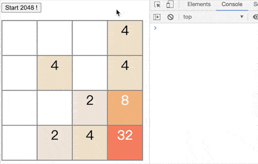

# go-2048-wasm 

Yet another WebAssembly demo.
 

# Build & Run 

```
$ git clone git@github.com:chenxinlong/go-wasm-2048.git
$ cd src/
$ GOARCH=wasm GOOS=js go build -o 2048.wasm 2048.go 
$ goexec 'http.ListenAndServe(`:8080`, http.FileServer(http.Dir(`.`)))'
```

Open `http://localhost:8080/2048.html` 